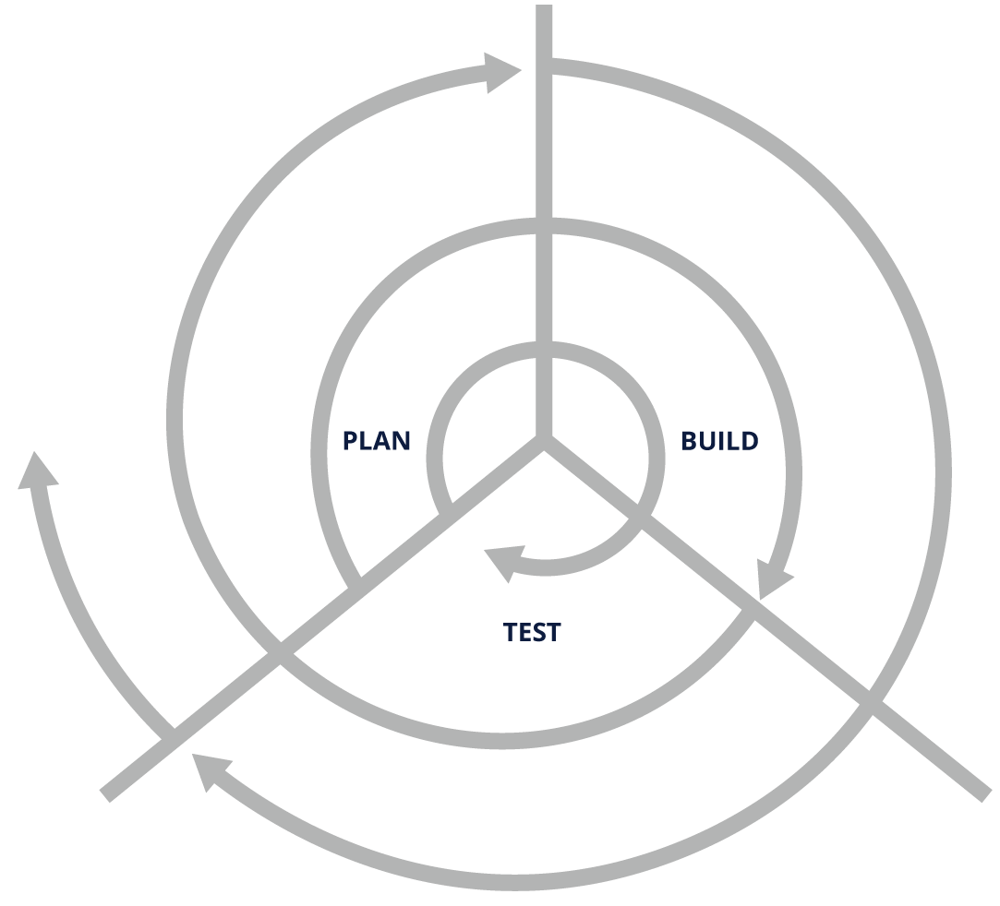

# WHAT IS DEVSECOPS?

## The Need For DevSecOps

To understand what DevSecOps is, let's begin with the question "_Why should we care about it?"_. What better way to answer this question than narrating a few stories which will help you understand the impact of what happens in its absence:

* In 2016, [attackers breached Uber’s system](https://www.cnbc.com/2018/09/26/uber-to-pay-148-million-for-2016-data-breach-and-cover-up.html) and stole the personal information of approximately 57 million users across the globe. The breached data included location history, credit card and bank account details, social security numbers, dates of birth, etc. This breach, followed by the subsequent cover-up, resulted in Uber paying $148 million in penalty. The root cause for this breach was a bug in the API.
* In 2017, a well-known and unpatched vulnerability in the underlying framework used by an [application deployed by Equifax](https://www.csoonline.com/article/3444488/equifax-data-breach-faq-what-happened-who-was-affected-what-was-the-impact.html), a credit reporting agency, resulted in attackers stealing sensitive data, including the personal and financial information of millions of people. This resulted in Equifax paying more than $575 million in settlement. The root cause of this breach was an unpatched vulnerability in a component used by the software.
* A known [vulnerability in Kubernetes](https://snyk.io/blog/a-serious-security-flaw-in-runc-can-result-in-root-privilege-escalation-in-docker-and-kubernetes/) allowed attackers to escalate privileges, break out of a container, and gain root access to the underlying host. This could have a wider impact worldwide with all the unpatched Kubernetes installations, as Kubernetes is the gold standard in the world of container-based deployments. Your systems would be vulnerable had you not patched/updated Kubernetes.

Do we need to emphasize more why it is crucial to incorporate security into the software delivery process?

Well, the good news is that DevSecOps practices can help you manage most issues similar to the ones mentioned above by helping you detect such risks early, make you aware of the impact, and push you to fix them before the issue blows out of proportion in a production environment. In some cases, these practices can even help you automatically mitigate concerns by patching/updating the application infrastructure. And this is why you should care about DevSecOps.

## The Path that Led to DevSecOps

### The Waterfall Model

Now, let’s look at the path that led to DevSecOps. This should help you better understand how software development and delivery models evolved over the years.

The most popular model used for developing and delivering software resembles a waterfall and involves moving from one step to another in the following sequence:

.png>)

**The Waterfall Model: Requirements, Design, Implementation, Verification, Maintenance**\
\
This model commonly results in longer deployment cycles, longer feedback loops, a significant amount of rework, and a slower pace of delivery overall.

### Agile Methodologies

Henry Ford’s assembly line sped up the process of manufacturing, which was then iterated and perfected by Toyota with the so-called[ Toyota Production System (TPS)](https://en.wikipedia.org/wiki/Toyota\_Production\_System). This system undoubtedly transformed automobile manufacturing.

**Iterative Development**

The principles and practices that evolved as part of this system, including "just-in-time" production, continuous feedback, and improvement ([Kaizen](https://en.wikipedia.org/wiki/Kaizen)), were then adapted by the wider manufacturing industry and, later, the software industry. This led to the development of [Lean IT](https://en.wikipedia.org/wiki/Lean\_IT) and, subsequently, to the creation of the [Agile Manifesto](https://agilemanifesto.org) in 2001, which resulted in development processes being sped up significantly.

### DevOps

Using agile methodologies, developers were able to build software faster, in smaller chunks and in an iterative fashion, with less reworking. They were also able to fix issues and create patches much more quickly. However, traditional operations teams that had adopted the agile principles were, in fact, left out of the development loop. While developers were more concerned about the speed of delivery, for operations teams, reliability was of foremost importance, which created their reluctance toward frequent deployments, along with reduced preparedness and a lack of tooling to support the same.\
**DevOps Model**

A set of principles, practices and tools which emerged to solve these problems came to be known as the DevOps practices. These ultimately resulted in the realization of the two conflicting goals of achieving faster delivery without compromising the reliability of the software. DevOps greatly relies on a set of automation tools that echo the assembly line in manufacturing. Today, DevOps represents the de facto practices used by organizations across the globe.

### DevSecOps

However, even with DevOps, the aspect of security remained unresolved. While you could improve the speed of deployment without compromising the reliability of the software using DevOps, the software development ended up either being slowed down due to security practices (which are implemented toward the end of the delivery pipeline) or having vulnerabilities that often leak into the production environment. DevOps could help patch these vulnerabilities quickly, but the ideal solution would have been to make the code secure without compromising the speed of delivery. This is what led to the creation of the principles, practices, and tools referred to as DevSecOps. DevSecOps is an organic extension of DevOps and follows a similar approach for implementation.

So, let us summarize why we need DevSecOps:

* DevOps enables fast deployments with high reliability.
* Traditional security cannot keep pace with it.

Therefore, the solution is to incorporate security into the DevOps practices. This approach is what we know as DevSecOps.

****
